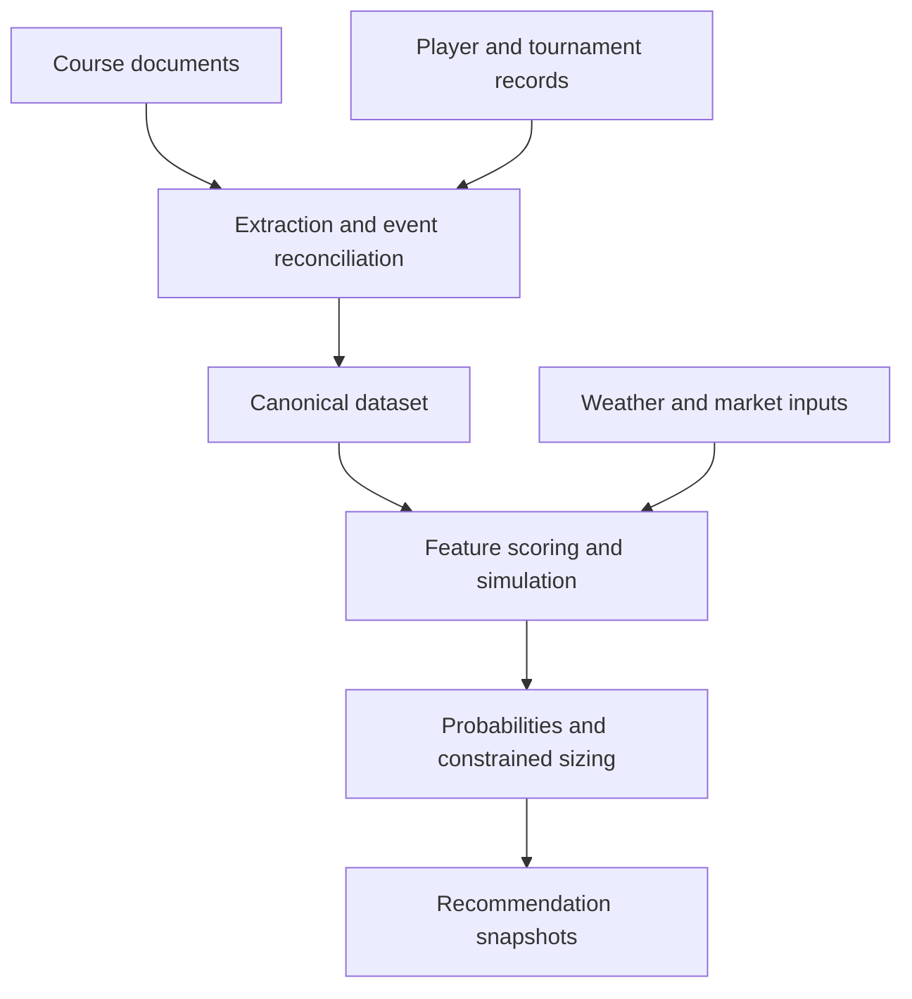

# PGA — Golf Analytics & Decision Support

[](https://github.com/smarkos22/PGA-Analytics/actions/workflows/ci.yml)

**Document extraction, entity reconciliation, canonical datasets, and statistical
modeling from a golf research application.**

Tournament documents, player statistics, course conditions, and market prices
describe the same events in different ways. This project connects those sources
into a reusable dataset and a weekly modeling workflow, while preserving
snapshots of recommendations as inputs change.

This repository contains selected source modules from the working application,
an offline example, and synthetic regression tests. The larger project also has
market-comparison, selection, hedging, and reporting interfaces. Those live
services and their records are outside this public snapshot.

## Start here

| Engineering problem | Implementation |
|---|---|
| Extract structured course information from variable PDF layouts | [Document parser](1_raw_data_extracts/grass_parser.py): extraction instructions, null handling, and structured output |
| Join event records across sources | [Event reconciliation](2_raw_data_mapping/results_grass_mapping.py): year/name candidate matching, confidence, and issue outputs |
| Build one reusable representation | [Canonical dataset builder](3_canonical_data_aggregation/build_canonical_dataset.py): event indexes, player rounds, source joins, and archived outputs |
| Match names without accepting ambiguous initials | [Player matcher](test_env/player_matching.py): normalization, unique plausible matches, and abstention |
| Convert features into probabilities and constrained allocations | [Recommendation model](4_modeling/production_betting_model.py): strokes gained, grass/context adjustments, market blends, and fractional Kelly |
| Model first-round uncertainty | [First-round model](4_modeling/frl_production_model.py): Monte Carlo simulation and tie-aware probabilities |
| Keep a record of changing decisions | [Recommendation tracker](test_env/model_recommendation_tracker.py) and [price snapshots](test_env/odds_snapshot.py) |

## Architecture



The numbered directories preserve the original pipeline stages. `test_env/` is
the application's historical directory name; the automated public tests live
in `tests/`.

## Run locally

Python 3.10 or newer is sufficient for the example and tests. No installation,
credentials, downloads, or third-party packages are required:

```bash
python3 examples/offline_model_demo.py
python3 -m unittest discover -s tests -v
```

The example calls the real model's probability and sizing functions using three
fictional players, invented scores and odds, and a hypothetical budget. It prints
JSON, writes no files, and submits no bets. This is a code demonstration, not a
trained forecast or a reproduction of the complete pipeline.

The tests exercise numerical stability, allocation caps, name normalization,
ambiguous-match abstention, snapshot deduplication, and missing-credential
refusal. CI runs them on Python 3.10 and 3.12 without API credentials.

## Scope and limitations

The acquisition and full-model entry points are included for source review.
They require separately obtained provider data, configuration, and optional
dependencies. API-backed extraction uses an exported `OPENAI_API_KEY` and can
incur provider charges; it is never invoked by the example or CI. No provider
responses, PDFs, personal records, account configuration, or trained artifacts
are distributed here.

Model weights, market blends, and simulation assumptions need independent
out-of-sample evaluation. Softmax probabilities are not automatically calibrated.
Grass associations need controls for sample size and repeated comparisons.
Historical backtests are not evidence of future profit, and this repository
makes no performance claim.

The code retains the structure of an evolving personal application. Large model
modules and file-based state are maintenance tradeoffs. Snapshot deduplication
currently compares recommendation content, and filenames have one-second
resolution; it is not a complete immutable event store. The offline tests cover
selected contracts, not the full pipeline.

## Project context

I built and operate the broader project with AI coding assistance. My work
includes defining the workflow, data-quality checks, modeling questions, review
rules, and follow-up investigations when outputs are wrong.

See [source selection and adaptations](docs/SOURCE_SELECTION.md) for the public
snapshot boundary. Related project: [Bjellac college football analytics](https://github.com/smarkos22/Bjellac-Analytics).

Publication controls and review limits are described in [the publication policy](docs/PUBLICATION_POLICY.md).
